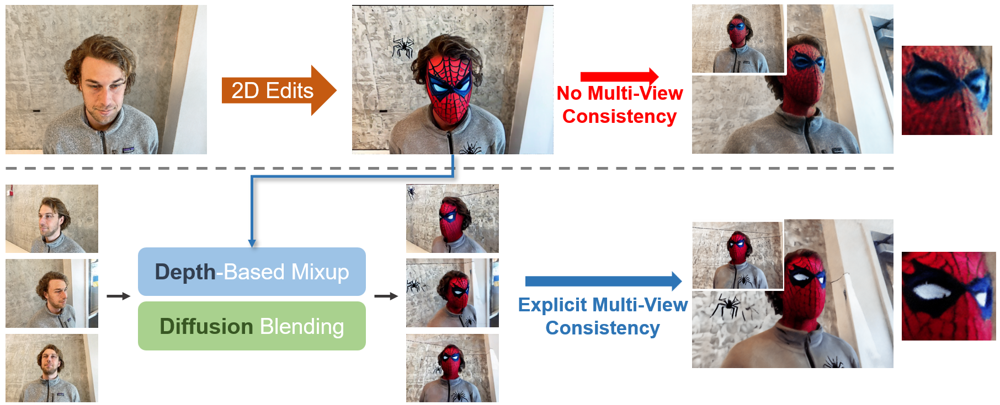

# ViCA-NeRF: View-Consistency-Aware 3D Editing of Neural Radiance Fields


This is the official implementation of [VICA-NeRF](https://openreview.net/pdf?id=Pk49a9snPe).
[Project-Page](https://dongjiahua.github.io/VICA-NeRF/)
## Installation
### Install pytorch and NeRFStudio:
**Recommented:** Follow the instructions on the [NeRFStudio](https://docs.nerf.studio/en/latest/quickstart/installation.html#dependencies).

**Directly install:**
```
conda create --name vica -y python=3.8 -y
conda activate vica -y
python -m pip install --upgrade pip

pip install torch==2.0.1+cu118 torchvision==0.15.2+cu118 --extra-index-url https://download.pytorch.org/whl/cu118 
pip install ninja git+https://github.com/NVlabs/tiny-cuda-nn/#subdirectory=bindings/torch
pip install nerfstudio torchtyping
```

### Install VICA-NeRF
```
git clone https://github.com/Dongjiahua/VICA-NeRF
cd VICA-NeRF

pip install --upgrade pip setuptools
pip install -e .
```

## Usage
To edit the NeRF, it should be firstly trained on a scene. Following the instructions on [NeRFStudio](https://docs.nerf.studio/en/latest/quickstart/installation.html#dependencies), it can be trained by:
```
ns-train nerfacto --data {PROCESSED_DATA_DIR}
```
The model will be saved in `outputs/.../nerfstudio_models`. You can use the following command to edit the NeRF:
```
ns-train vica --data {PROCESSED_DATA_DIR}  --load-dir {outputs/.../nerfstudio_models}  --pipeline.prompt {"Instruction"}
```

#### Options
Our method supports great controll on the final result by 2D edits. The following options can be used:
```
--pipeline.control {bool} # Whether to mannuly set the target content. Default: False
--pipeline.warm_up_iters {int} # The number of iterations to warm up the model. Default: -1 (automatically set the warm up iterations)
--pipeline.post_refine {bool} # Whether to refine the result by post-refinement. Default: False. May hurt the result for large scene.
```

## Other tips for hyper-parameters
One previous work [Instruct-NeRF2NeRF](https://github.com/ayaanzhaque/instruct-nerf2nerf?tab=readme-ov-file#training-notes) give great suggestions on some tips for editing hyper-parameters. Please refer to their suggestions for better results.

## Acknowledgments
Our code is integrated based on the code framework of Instruct-NeRF2NeRF, thanks to their wonderful work

## Citation
```
@inproceedings{dong2023vica,
  title={ViCA-NeRF: View-Consistency-Aware 3D Editing of Neural Radiance Fields},
  author={Dong, Jiahua and Wang, Yu-Xiong},
  booktitle={Thirty-seventh Conference on Neural Information Processing Systems},
  year={2023}
}
```
